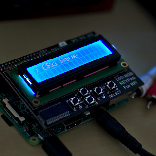
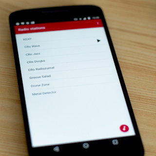

# PiRadio Python server

This is Pytho server for my PyRadio project - Internet radio player for Raspberry Pi.

This repository contains two services for Raspbery Pi
1. API: Core service - Internet radio player with [MQTT](http://mqtt.org/), [REST](https://en.wikipedia.org/wiki/Representational_state_transfer) and [Socket.IO](https://socket.io/) interface
2. LCD: Application to control PiRadio with [LCD Shield](https://www.adafruit.com/product/1110)

## Screenshots

## Companion mobile application

You can grab companion mobile application [here](https://github.com/stepanmracek/piradio-io)

## Instalation and running
1. Checkout this repository
   - `https://github.com/stepanmracek/piradio-py.git`
2. Install Python virtual environment
   - `cd piradio-py && virtualenv -p python3 env`
3. Install requirements with PIP
   - `pip install -r requirements.txt`
4. Copy (and modify paths if needed) systemd services
   - `sudo cp systemd/* /lib/systemd/system/`
5. Refresh systemd daemon
   - `sudo systemctl deamon-reload`
5. Start service
   - `sudo systemctl enable piradio-api piradio-lcd --now`